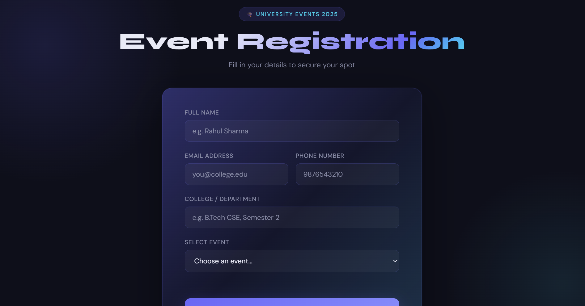
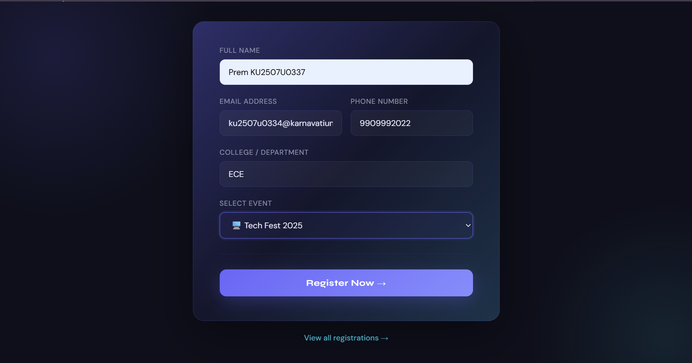
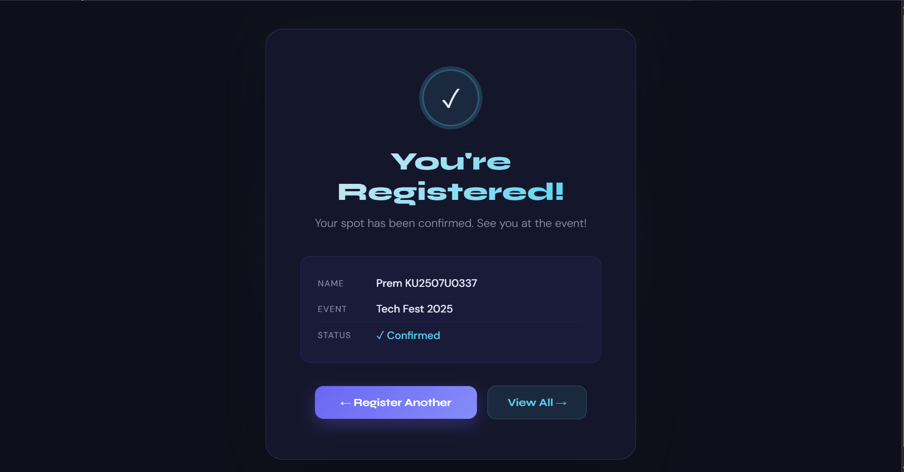
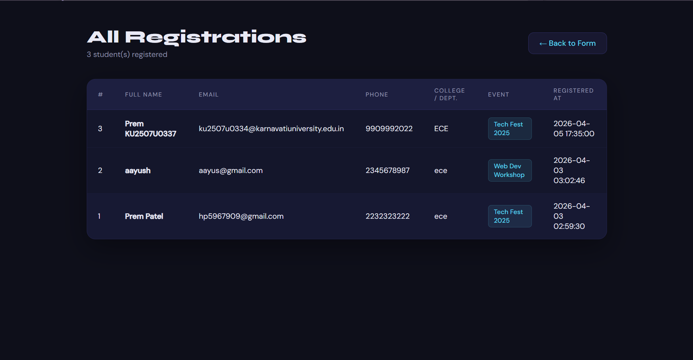

# ☁️ Cloud-Based College Event Registration System
**Google Cloud Digital Leader — Semester 2 Capstone Project**

| | |
|---|---|
| **Student** | Prem Patel |
| **KU-ID** | KU2507U0337 |
| **Class** | ECE(H) |
| **Course** | Google Cloud Digital Leader |

---

## 📌 What is This Project?

A web application where students can register for college events like Tech Fest, Cultural Night, and Workshops. Built as a local prototype using Python Flask and SQLite, with a planned Google Cloud architecture for real-world deployment.

---

## 🛠️ Tech Stack

| Layer | Technology |
|---|---|
| Frontend | HTML + CSS + JavaScript |
| Backend | Python + Flask |
| Database | SQLite (local file-based) |
| Templating | Jinja2 (built into Flask) |

---

## 📁 Folder Structure

```
college-event-registration/
│
├── app.py                  ← Flask backend server
├── database.db             ← SQLite database (auto-created on first run)
├── README.md               ← This file
│
├── sqlite3.exe             ← SQLite CLI tool (downloaded from sqlite.org)
├── sqldiff.exe             ← SQLite diff tool
├── sqlite3_analyzer.exe    ← SQLite analyzer tool
├── sqlite3_rsync.exe       ← SQLite rsync tool
│
├── assets/
│   └── screenshots/        ← App screenshots
│       ├── registration-form.png
│       ├── success-page.png
│       ├── all-registrations.png
│       └── database-view.png
│
└── templates/
    ├── index.html          ← Registration form (main page)
    ├── success.html        ← Success confirmation page
    └── registrations.html  ← Admin view — all registrations
```

> ⚠️ Flask requires HTML files to be inside the `templates/` folder. Do not move them.

---

## 📸 Screenshots













---

## ⚙️ Setup & Installation

### 1. Install Python
Download from **https://python.org** → During install, check ✅ **"Add Python to PATH"**

```bash
python --version
```

### 2. Install Flask
```bash
pip install flask
```

### 3. SQLite Tools — Already Included
The `sqlite3.exe` and other SQLite tools are already in the root of this project folder. They were downloaded from **https://sqlite.org/download.html** (sqlite-tools-win-x64 zip) and extracted directly into the project folder. No separate installation needed — just use them directly.

---

## ▶️ How to Run

```bash
# Navigate to project folder
cd "%USERPROFILE%\Downloads\college-event-registration"

# Run the app
py app.py
```

Open browser and go to:
```
http://127.0.0.1:5000
```

To stop the server: press `Ctrl + C` in terminal.

---

## 🌐 Application URLs

| URL | Description |
|---|---|
| `http://127.0.0.1:5000/` | Student registration form |
| `http://127.0.0.1:5000/registrations` | View all registrations (admin) |

---

## 🗄️ How the Database Works

SQLite database is **created automatically** on first run by this code in `app.py`:

```python
def init_db():
    conn = sqlite3.connect('database.db')  # Creates file if not exists
    cursor = conn.cursor()
    cursor.execute('''
        CREATE TABLE IF NOT EXISTS registrations (
            id        INTEGER PRIMARY KEY AUTOINCREMENT,
            full_name TEXT NOT NULL,
            email     TEXT NOT NULL,
            phone     TEXT NOT NULL,
            event     TEXT NOT NULL,
            college   TEXT NOT NULL,
            timestamp DATETIME DEFAULT CURRENT_TIMESTAMP
        )
    ''')
    conn.commit()
    conn.close()
```

### View Your Data via Command Prompt

```bash
# sqlite3.exe is already in your project folder — run this directly
sqlite3.exe database.db

# Inside SQLite shell — type these commands
.headers on
.mode column
SELECT * FROM registrations;
.quit
```

---

## ☁️ Google Cloud Architecture (Planned)

| Local Prototype | GCP Equivalent |
|---|---|
| Flask on localhost:5000 | Cloud Run |
| SQLite (database.db) | Firestore |
| Direct INSERT in app.py | Pub/Sub → Cloud Function → Firestore |
| http://127.0.0.1:5000 | https://your-app.run.app |
| Only you on laptop | Anyone in the world |
| Manual server | Zero — fully serverless |

**GCP Flow:**
```
Student → Cloud Run → Pub/Sub → Cloud Function → Firestore
```

---

## 📋 Quick Commands Reference

```bash
# Run the app
py app.py

# Install Flask
pip install flask

# View database
sqlite3.exe database.db

# Git commands
git add .
git commit -m "your message"
git push -u origin main
```

---

*Built by Prem Patel | KU2507U0337 | ECE(H) | Google Cloud Digital Leader Capstone 2026*
